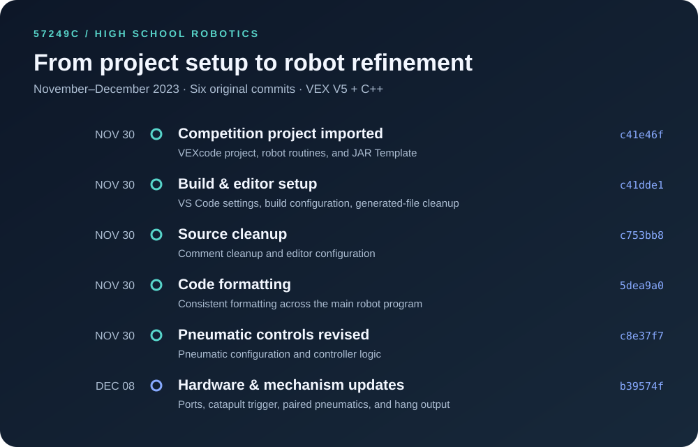

<div align="center">

# VEX Robotics · 57249C

**High school competition robotics · 2023–2024 Over Under season**

C++ software for a VEX V5 robot: driver control, autonomous routines, and sensor-driven mechanisms.

[Explore the code](src/main.cpp) · [Development timeline](#development-timeline) · [Hardware & controls](#hardware--controls)

</div>

---

## About the project

This repository preserves my **high school VEX Robotics competition work** for team **57249C**. It contains the C++ control software for our Over Under robot, including a six-motor drivetrain, intake, catapult, pneumatic mechanisms, and autonomous routines for both sides of the field.

The project brought together embedded programming, feedback control, sensor input, and the practical task of coordinating several mechanisms on one competition robot. Robot-specific code builds on the **VEX V5 C++ API** and **Jackson Area Robotics' JAR Template** for motion control.

The original commits in this repository run from **November 30 to December 8, 2023**. The presentation and documentation were added in September 2026; the historical robot source and commit history are preserved.

## What the software does

| System | Implementation |
| --- | --- |
| Driver control | Arcade-style driving with an exponential joystick response and reduced turning input; a 20 ms delay in the normal control loop. |
| Autonomous motion | JAR Template distance, heading, and swing-turn commands, with configured PID constants and exit conditions. |
| Match routines | Separate `farside_auton()` and `closeside_auton()` sequences coordinating drivetrain, intake, and pneumatics. |
| Catapult | Rotation-sensor state logic, distance-sensor triggering, and manual firing input. |
| Pneumatics | Paired A/B outputs and a separate H output, with cooldown-based controller toggles. |
| Skills & endgame | An `auton_skill()` sequence and a timed `highHang()` driver action. |

**Default autonomous:** `autonomous()` currently calls `farside_auton()`. The close-side and skills calls are present but commented out. The skills routine currently uses an `auton_tribal < 4` condition; that variable is a software counter, not a verified scoring measurement.

## Code at a glance

```text
Competition callbacks
├── pre_auton()   → device initialization + motion constants
├── autonomous()  → far-side routine → JAR motion + mechanisms
└── usercontrol() → drive + intake + catapult + pneumatics + hang
```

| File | Start here for… |
| --- | --- |
| [`src/main.cpp`](src/main.cpp) | Competition callbacks, chassis configuration, controls, and match/skills routines. |
| [`src/robot-config.cpp`](src/robot-config.cpp) | Motor ports, gear ratios, reversals, and sensor/output declarations. |
| [`src/autons.cpp`](src/autons.cpp) | Motion-control constants and template demonstration routines. |
| [`src/JAR-Template/`](src/JAR-Template) | Bundled motion-control, PID, and odometry implementation from JAR Template. |
| [`include/`](include) | Project and template headers. |
| [`C-team-Far.v5code`](C-team-Far.v5code) | Original VEXcode project metadata. |
| [`.vscode/vex_project_settings.json`](.vscode/vex_project_settings.json) | Saved VEX VS Code project settings. |

## Hardware & controls

The port map below describes the committed configuration. The inertial sensor is configured in `src/main.cpp`; other devices are declared in `src/robot-config.cpp`.

| Component | V5 / three-wire ports |
| --- | --- |
| Left drivetrain: front / middle / back | 1 / 2 / 12 |
| Right drivetrain: front / middle / back | 10 / 9 / 8 |
| Intake / catapult motors | 20 / 7 |
| Inertial / catapult rotation / distance sensors | 19 / 11 / 6 |
| Pneumatic outputs | A / B / H |

| Controller input | Action |
| --- | --- |
| Axis 3 / Axis 1 | Forward–reverse / steering |
| L1 / L2 | Intake / outtake |
| R1 | Toggle catapult control |
| B | Manual fire input while catapult control is enabled |
| R2 | Toggle paired pneumatic outputs A and B |
| A | Toggle pneumatic output H |
| X | Run the timed high-hang sequence |

## Opening and building

1. Clone the repository:

   ```sh
   git clone https://github.com/YuntongGuo/C-teamcode.git
   cd C-teamcode
   ```

2. Open the folder in **Visual Studio Code with the VEX Robotics extension**. The saved settings target V5 C++ and SDK `V5_20220726_10_00_00`. If the extension does not recognize the legacy project, use its project import workflow for `C-team-Far.v5code`.
3. Install/select the V5 SDK and toolchain required by the extension, then build using the extension's build command. See the [official VEX project guide](https://kb.vex.com/hc/en-us/articles/31167334740500-Downloading-and-Running-a-VEX-Project-in-VS-Code).
4. Before downloading to hardware, match the port map, motor reversals, wheel geometry, and controller configuration to the actual robot. Recheck motion tuning and autonomous starting position.

This is a historical competition-code archive. The VEX SDK/toolchain is external to the repository. A fresh firmware build and physical robot run were **not performed** during the 2026 documentation update. The hanging action contains blocking waits, and catapult logic/skills counting should be reviewed before reuse on another robot.

## Development timeline



Milestones below summarize the actual diffs. Links open the original commits, whose dates and messages are unchanged.

| Date | Milestone | Commit |
| --- | --- | --- |
| Nov 30, 2023 | Import the VEXcode competition project and JAR Template sources. | [`c41e46f`](https://github.com/YuntongGuo/C-teamcode/commit/c41e46fc1cf8c0c017beb4720179464190bf2237) |
| Nov 30, 2023 | Add VS Code project settings, update build configuration, and remove generated build outputs from the working tree. | [`c41dde1`](https://github.com/YuntongGuo/C-teamcode/commit/c41dde1fd5c1d377c4f5294e3184e26d6f478c99) |
| Nov 30, 2023 | Clean up comments and add editor configuration. | [`c753bb8`](https://github.com/YuntongGuo/C-teamcode/commit/c753bb8a5e8328d8f17d5c283fcbd452ec1c3b3a) |
| Nov 30, 2023 | Format the main robot program. | [`5dea9a0`](https://github.com/YuntongGuo/C-teamcode/commit/5dea9a076488842a2b94c3ca4d7af535a84c5171) |
| Nov 30, 2023 | Revise pneumatic configuration and controls. | [`c8e37f7`](https://github.com/YuntongGuo/C-teamcode/commit/c8e37f730d6972bba38d824212943ef5ce810e2b) |
| Dec 8, 2023 | Update motor/sensor ports, catapult triggering, paired pneumatics, and the hang output. | [`b39574f`](https://github.com/YuntongGuo/C-teamcode/commit/b39574f466681a0f5c3d41491d003a7a0cccf2b3) |

[Browse the full commit history →](https://github.com/YuntongGuo/C-teamcode/commits/master/)

## Credits

- **JAR Template — Jackson Area Robotics:** the bundled motion-control foundation. [Project and documentation](https://jacksonarearobotics.github.io/JAR-Template/).
- **VEX Robotics:** V5 hardware, SDK, and competition platform. [V5 API documentation](https://api.vex.com/v5/home/index.html).

This repository documents my high school work within a team robotics project. Third-party template and platform code are credited above; their authors retain their respective rights.
